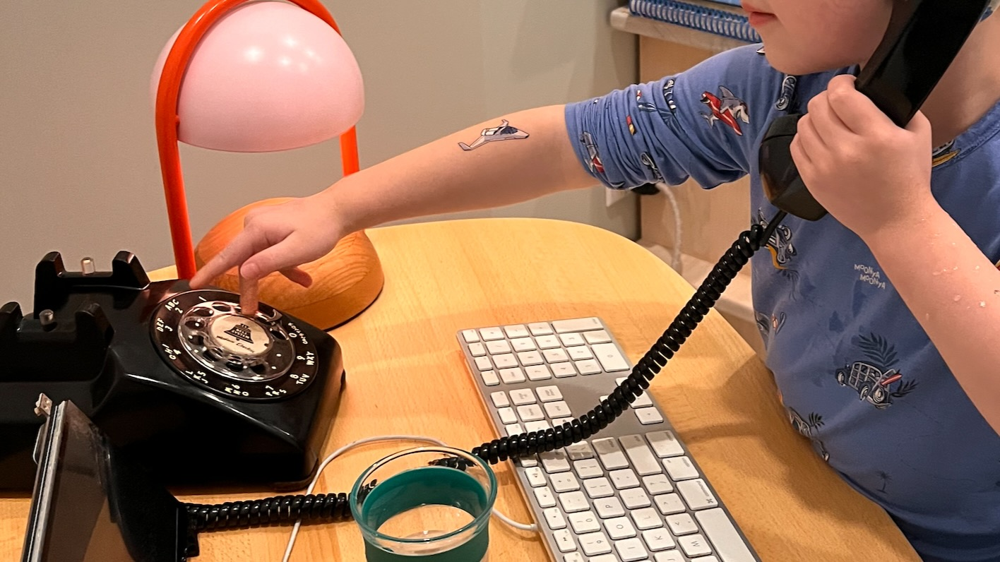
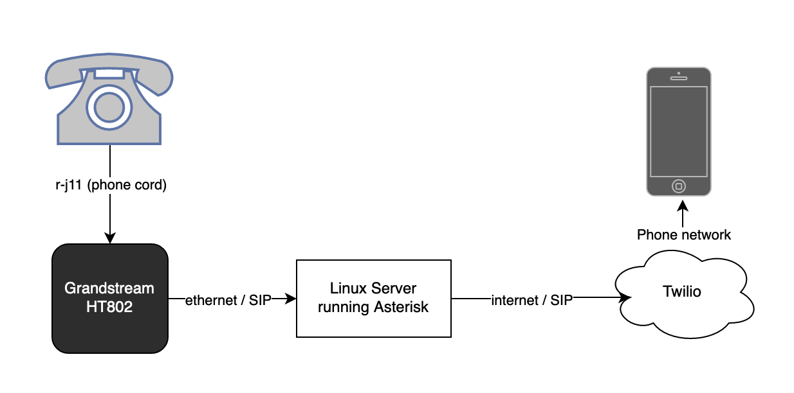
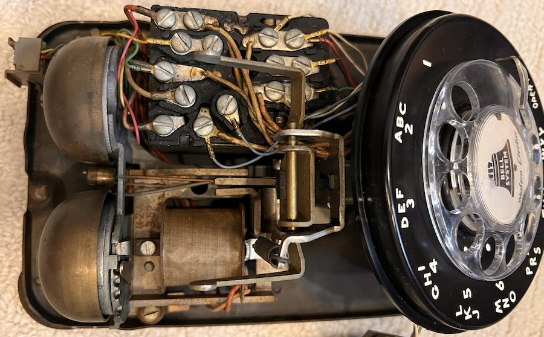

# Rotary Phone Project



This is an account of a project we recently did. The files aren't intended to constitute a cohesive runnable project, they're just a loose collection of scripts. It's mostly here to remind me how it works, but hopefully it's useful to others.

## Background

Recently we went to the MoMA with my 4 year old son. Some modern art is hard to appreciate as a kid, but the exhibit he _loved_ was one where they had a bunch of rotary phones and you could [dial a number and it would read you a poem](https://www.moma.org/collection/works/294325). I wanted to replicate something like this at home.

## Features

Some things I wanted it to be able to do:

* Dial out to a short list of family contacts. It's not something I think about much, but when I was a kid there was a phone on the wall and once I could reach it, I could use it. Now, if you're not old enough to have a cell phone, you also can't call anyone at all.
* Allow incoming calls from that same list of family contacts. Requires an actual phone number.
* On a different extension, hear a random joke.
* ~~Hear a random k-pop song.~~ This was an easy thing to start with, but not actually that fun. The audio quality is pretty terrible for music.
* Get NYC MTA train status. My son loves the subway, and is already pretty proficient at using a unix terminal to query the status of different trains, but it would be fun to hear an announcement too.

## Equipment

60 years ago, every household in America had one or more rotary phones, so they're not exactly hard to find. I bought one off of Ebay for ~$25. Not all of them are guaranteed to be in working order, but these things are pretty solid so if the outside looks undamaged, it's likely alright. Worst case you might have to spend another $25 and try again. I got a [Western Electric Bell 500](https://en.wikipedia.org/wiki/Model_500_telephone).

If we lived in 1960 (or even 2000) I could plug it into the wall and the project would be mostly done. But if I want to do anything interesting, I need to adapt it to VoIP. My initial thought was to hack up the inside of the phone and use a Raspberry Pi or ESP32 or something, but between driving 48V DC or replacing most of the internals it seemed a bit out of reach. Instead, I used the phone unmodified and connected it to a [Grandstream GS-HT802](https://www.grandstream.com/products/gateways-and-atas/analog-telephone-adaptors/product/ht802) which lists rotary support in the specs. This currently goes for ~$50 [on Amazon](https://www.amazon.com/Grandstream-GS-HT802-Analog-Telephone-Adapter/dp/B01JH7MYKA).

To accomplish the other features, I wanted to use Asterisk, an open source PBX. Using Asterisk to make a phone that tells you jokes is a bit like using Kubernetes to host your blog, but I had a little bit of experience with it from ~20 years ago and it seemed to do everything I wanted. Ideally I would have been able to attach the Grandstream adapter directly to the machine running the Asterisk server. But for the equipment I had, I ended up attaching the Grandstream to the Raspberry Pi in my son's room, and having it bridge wifi to an old server under my desk running Asterisk. This hasn't flaked out yet but seems like it could be brittle. At some point I'd like to consolidate these into a more powerful Raspberry Pi 5 that runs Asterisk and is directly connected to the GrandStream.



## Rotary Phone Setup

Pretty much just plug the RJ11 port of the phone into port 1 on the GrandStream. This should mostly Just Work, but there are some potential caveats depending on the rotary phone you receive. I'd try it first, but if you have trouble with it ringing later in the process you can try:

* It's possible that your phone has been wired for a "party line" instead of regular service. This would require unscrewing the cover (make sure it's unplugged from the Grandstream) and a small amount of rewiring which differs based on your phone model.
* The one I received _wasn't_ wired for a party line, but was effectively muted. I had to take the cover off and unhook part of the ringer. I haven't seen discussion of this online anywhere.

Opening it up:



After everything else checked out, I realized the ringer had been locked, and moved it to this position to fix:


## Asterisk setup

I installed Asterisk via dpkg on Ubuntu 22. Setup was made a little more complicated by the RPi wifi bridge, which meant that the Grandstream was techically behind NAT from the perspective of Asterisk. Asterisk is trying to move from legacy `sip` module to `pjsip`, but I was only able to get `sip` to work so I stuck with that. The `/etc/asterisk/sip.conf` relevant parts:

```
[rotary]
type=friend
nat=force_rport,comedia
secret=s3cr3t
host=dynamic
context=rotary-context
qualify=yes
```

The `nat` and `host=dynamic` aspects wouldn't be necessary if the Grandstream was on the same network as Asterisk. 

## Connecting the phone to Asterisk

Plugging the Grandstream device in, it automatically obtained an IP via DHCP and I was able to log into its web interface using default credentials. Setup was pleasantly straightforward, I just configured fx-1's sip server to point to the Asterisk server's address.

Relevant settings from `fxs-1`:

```
Active: Yes
Primary SIP Server: [asterisk ip]
NAT Traversal: Keep-Alive *
SIP User ID: rotary
SIP Authenticate ID: rotary
SIP Registration: Yes
Enable SIP OPTIONS/Notify Keep-Alive: OPTIONS *
Enable Pulse Dialing: Yes
Enable Hook Flash: Yes
Enable High Ring Power: Yes **

* - only required because of the RPi wifi bridge
** - maybe not necessary, but makes ringer more likely to work
```

At this point, you should be able to pick up the phone's handset and get a dialtone. If you don't, there are some different debugging avenues:

### Asterisk side

You can run `sudo asterisk -rvvvvv` to start the asterisk repl. Then:

* `sip show peers` should list `rotary/rotary` with the right Host and hopefully a Status of "OK"
* `sip set debug on` will give loads of SIP debug data, after enabling that you can unplug and replug the grandstream and hopefully see it trying to connect

### Grandstream side

If you're not seeing any peers or any sip logs from asterisk, you can also use the Grandstream web UI and enable sip logging to hopefully see what is going on.

## Building Stuff in Asterisk

At this point the phone is connecting to Asterisk and the real fun can begin. :)

### Play a K-Pop song

The easiest one first. Asterisk can play back an audio file, but is relatively limited in the types of files it can play. You'll likely need to convert your file to 8KHz wav. Then put something like this in `/etc/asterisk/extensions.conf`:

```
[rotary-context]
exten => 1234,1,Answer()
    same => n,Playback(/path/to/file.wav)
    same => n,Hangup()
```

You can reload Asterisk config with (among others) `sudo systemctl reload asterisk`. This will let you dial 1,2,3,4 on the phone, answer, play the audio, and hang up on you.

### Play MTA Subway Status

### Speech Synthesis

For this one, we need some sort of text-to-speech synthesis. TTS has come a _long_ way since Asterisk was initially created back in the early 2000s, so I opted for hooking in a third party TTS engine. I chose [piper](https://github.com/rhasspy/piper) which sounds pretty good and notably is fast--it can run on a Raspberry Pi.

Piper can pipe to stdout, or a file or whatever. I was hoping I could shell out to piper with my text and _stream_ the result back to asterisk via stdout, but it was not meant to be. I went so far as to try to write a c Asterisk module that would accept raw audio over stdout, and eventually discovered that a) audio formats are hard, and b) I lack any sort of intuition about debugging when all I can get back are silence and a few popping noises.

Instead I wound up writing an extension subroutine that calls out to piper, has it write to a tempfile, plays the tempfile, then deletes the tempfile. This means the entire speech generation has to complete before it can begin playing, but so far that has not taken longer than ~250ms on my Asterisk server. (a decade+ old core i7)

The `speak.sh` bash script:

```sh
#!/bin/bash

/path/to/piper/piper \
    --length_scale=5 --sentence_silence=0.5 \
    --model /path/to/piper/voices/en_US-amy-medium.onnx \
    --output-raw -f - | \
  sox -v 0.7 -t raw -e signed -r 22050 -b 16 - -r 8000 -b 16 -c 1 -t wav -
```

This uses the "Amy" medium-fidelity model to generate some speech, then `sox` to translate it to one of the few audio formats that Asterisk can play.

Then we create the subroutine in `extensions.conf`:

```
[speak]
exten => s,1,NoOp(Text to speech)
 same => n,Set(filename="speech-${RAND()}${RAND()}")
 same => n,System(echo "${ARG1}" | /path/to/speak.sh > /tmp/${filename}.wav)
 same => n,Playback(/tmp/${filename})
 same => n,System(rm -f /tmp/${filename}.wav)
 same => n,Return()
```

Then I can call it like this from a regular extension:

```
exten => 888,1,Answer() ; Say something
 same => n,GoSub(speak,s,1("Hello world"))
```

This works pretty well, but a very common pattern is that I want to play some audio for the dialer while at the same time accepting input from them. How maddening is it when you're trying to cancel Comcast and they're making you listen to all of the menu options because _they might have changed_? If we play audio, _then_ accept input, Asterisk blocks and we're no better than Comcast. Instead of `Playback()` we can use `Read()`, which accepts some audio and waits at the same time. We can make a separate subroutine for that:

```
[speak-get-digits]
exten => s,1,NoOp(Text to speech requesting digits)
    same => n,Set(filename="speech-${RAND()}${RAND()}")
    same => n,Set(digitcount=${IF($["${ARG2}"=""]?1:${ARG2})})
    same => n,System(echo "${ARG1}" | /path/to/rotary/speak.sh > /tmp/${filename}.wav)
    same => n,Read(digits,/tmp/${filename},${digitcount})
    same => n,System(rm -f /tmp/${filename}.wav)
    same => n,Return(${digits})
```

Asterisk has a long lineage and unfortunately has some serious warts, one of them being return values. In order to call this you need to do:

```
same => n,GoSub(speak-get-digits,s,1("Dial a number to hear the status of a numbered train or dial 9 for a letter train.",1))
same => n,Set(digit=${GOSUB_RETVAL})
```

`${GOSUB_RETVAL}` is a sort of environment variable set upon completion of your subroutine. I'd recommend immediately setting it to a different name like I've done above. The `1` we pass in as a second argument tells asterisk to only wait for one digit before proceeding.

#### Talking to the MTA

This part came from the pieces of the aforementioned unix terminal mta status project. It's a command line script that takes the number or letter of a train, fetches from the HTTP API the MTA website runs on, and returns the status in text form.

What I discovered was that the response from the MTA was pretty good for viewing on a screen, but not quite suitable for text-to-speech. I had to modify the app to do a replacement pass, to change abbreviations where appropriate: Sq to Square, St to Street (but also St George to Saint George), etc. Then a secondary pass to correct mispronunciations. (Houston -> Howston, Coney Island -> Coaney Island etc) The last part probably varies a lot from one TTS engine to the next.

#### Putting it together

The numbered trains (1-7) were a piece of cake. Read a digit, phone user dials it on the rotary, pass it to the mta script, generate audio. Letters were quite a bit harder:

* While there are only 9 numbers, you can achieve the letters by doing a proto-T9 implementation where the user dials "2" for "A", "22" for "B", etc.
* But rotary phones and the subway share an interesting mid-century oddity that they just _skip_ various letters. Unfortunately these aren't the same letters. While the subway skips "I", "O", "P", etc, rotary phones skip "Q", and "Z". These are both actual subway lines so need to be mapped to something else.
* The subway has 3 shuttle lines (Grand central, Franklin, Rockaways) and the Staten Island Railway; I just made "S" its own sub-menu with 4 options.

Dial "33" to start the subway status tree:

```
exten => 33,1(start),Answer()
 same => n,GoSub(speak-get-digits,s,1("Dial a number to hear the status of a numbered train or dial 9 for a letter train.",1))
 same => n,Set(digit=${GOSUB_RETVAL})
 same => n,GotoIf($["${digit}" = "9"]?lettertrains)
 same => n,System(/path/to/rotary/mta.sh ${digit} > /tmp/piper.wav)
 same => n,Playback(/tmp/piper)
 same => n,Goto(start)
 same => n(lettertrains),NoOp(Status for letter trains)
 same => n,GoSub(speak-get-digits,s,1("Dial the letter for your train",4))
 same => n,Set(letters=${GOSUB_RETVAL})
 same => n,Gotoif($["${letters}" = "777"]?shuttle)
 same => n,System(/path/to/rotary/mta.sh letter:${letters} > /tmp/piper.wav)
 same => n,Playback(/tmp/piper)
 same => n,Goto(start)
 same => n(shuttle),NoOp(Status for shuttles)
 same => n,GoSub(speak-get-digits,s,1("Dial 1 for grand central shuttle, dial 2 for franklin avenue, dial 3 for far rockaway shuttle, dial 4 for staten island railway", 1))
 same => n,Set(digit=${GOSUB_RETVAL})
 same => n,System(/path/to/rotary/mta.sh shuttle:${digit} > /tmp/piper.wav)
 same => n,Playback(/tmp/piper)
 same => n,Goto(start)
```

### Phone Calls

At this point many hours in, we're almost to the part you could have achieved 30 years ago by buying a phone and plugging it in to any house in America.

In order for someone to use the phone to talk to another person with a regular phone, we need to connect to the phone network. Long ago it was apparently possible to use Google Voice, but from everything I've read it's no longer possible. I signed up for Twilio: not the cheapest, but it's reputable and developer-focused so pretty easy to work with.

Buying a number will cost a few dollars a month. I let my son pick his own phone number. It has a lot of sevens in it.

Twilio offers two different services that seem like they could be relevant: I started out exploring "Twilio Elastic Sip Trunking" which "enables you to make & receive telephone calls from your IP communications infrastructure around the globe over a public or private connection" and sounds like exactly what I need. This is probably the "correct" way to bridge Asterisk into Twilio, especially if you're doing something real. But this approach assumes your Asterisk server has a public IP and mine sits behind my home router. Using this approach I was able to have Asterisk dial out, but Twilio could not make calls into Asterisk. NAT strikes again!

Instead, I went the route of creating a Programmable SIP Domain in Twilio and having Asterisk just act like another SIP client. This let Asterisk register with Twilio and punch through NAT using the usual OPTIONS keepalive trick.

The steps are:

1. Create a [SIP Domain](https://console.twilio.com/us1/develop/voice/manage/sip-domains)
2. Create a Credential List. This is how Asterisk will authenticate with Twilio. Set up Voice Authentication with the Credential List.
3. Enable SIP Registration.

On the Asterisk side, we'll need something like this in our `/etc/asterisk/sip.conf`:

```
[twilio-trunk](!)
type=peer
context=from-twilio ; Which dialplan to use for incoming calls
dtmfmode=rfc4733
canreinivite=no
insecure=port,invite

[twilio](twilio-trunk)
host=replace-with-your-sip-name.sip.us1.twilio.com
defaultuser=michael        ; username
remotesecret=totallysecure ; password
defaultexpiry=605
minexpiry=605
qualify=yes
```

Replace the host with the host from the SIP Domain you created in Twilio. And replace `defaultuser` and `remotesecret` values with the username and password from the Credentials List you created.

* `qualify=yes` will cause Asterisk to keep the NAT hole alive by periodically sending OPTIONS requests. 
* `defaultexpiry` and `minexpiry` keep us from sending so many pings that Twilio rate-limits us. 
* `context=from-twilio` means that incoming calls will wind up in the `from-twilio` context in `extensions.conf`, where you can route them to your rotary phone:

After you reload Asterisk, you can run `sudo asterisk -rvvvvv` and `show sip peers` and see both your rotary phone as well as Twilio:

```
CLI> sip show peers
Name/username             Host                                    Dyn Forcerport Comedia    ACL Port     Status      Description
rotary/rotary             192.168.1.33                             D  Yes        Yes            5060     OK (22 ms)
twilio/michael            54.172.60.0                                 Yes        No             5060     OK (18 ms)
```

#### Dialing out

With the connection established, we need to tell Asterisk how to route a call to Twilio, and need to tell Twilio what to do when it gets it.

Asterisk config, in `extensions.conf`:

```
exten => 81,1,Answer() ; Call Dad
 same => n,GoSub(speak,s,1("Calling dad\!\!"))
 same => n,Set(CALLERID(all)="Rotary"<19787777777>)
 same => n,Dial(SIP/twilio/+12565121024)
```

In this case you'd replace `19787777777` with the Twilio phone number you purchased, and `12565121024` with the number you're calling. I'm not entirely sure the caller ID part is necessary, but it seems like it.

Back in Twilio, we want our SIP domain to receive a call and pass it right on through via our purchased phone number. To do this we can create a [TwiML bin](https://console.twilio.com/us1/develop/twiml-bins/twiml-bins):

```
<?xml version="1.0" encoding="UTF-8"?>
<Response>
    <Dial answerOnBridge="true" callerId="{{#e164}}{{From}}{{/e164}}">{{#e164}}{{To}}{{/e164}}</Dial>
</Response>
```

Give it a name like "OutboundCall", then go back to the SIP Domain configuration:
* Set Call Control Configuration to configure with "Webhooks, TwiML Bins, Functions, Studio, Proxy"
* A call comes in: set to "TwiML Bin" then select your bin name
* The rest of the fields don't matter

Make sure SIP routing is Active.

Now try dialing "81" from your rotary phone. It should route to your recipient.

#### Receiving calls

With our outbound setup, Asterisk could technically dial _any_ number but we limit which numbers can actually be dialed by only explicitly dialing them in `extensions.conf`. For receiving calls, we want to make sure we also limit it to specific callers. We could easily achieve "pass any call through" with the same TwiML Bin approach, but "limit to phone numbers x,y,z" is a bit too much for TwiML so I opted for a Twilio Function.

In Twilio, [create a Service](https://console.twilio.com/us1/develop/functions/services) to make a new function. I named mine `incoming-call`, with this logic:

```javascript
const allowed = ['+12565121024', '+13435555555', ...];

exports.handler = function(context, event, callback) {
    console.log("Receiving call", event.From);
    let twiml = new Twilio.twiml.VoiceResponse();

    if(allowed.includes(event.From)) { // Ensure the number is in E.164 format
        console.log("Matched, dialing...");
        const dial = twiml.dial({answerOnBridge: true}).sip("rotary@replace-with-your-sip-name.sip.twilio.com");
    } else {
        console.log("Call was rejected");
        twiml.reject(); // Rejects the call if the number does not match
    }

    callback(null, twiml);
};
```

Make sure you save and click "Deploy all" to actually deploy it.

Then go to Phone Numbers -> Manage -> Active Phone Numbers and select the number you purchased to configure it. Choose "Webhooks, TwiML Bin, Function, Studio Flow, Proxy Service", then choose "Function" and the one you named `incoming-call` and choose the Environment and Function Path. (there should be only one option for each)

At this point, you can go back to the Function editor, enable Live Logs, and actually try to call your Twilio number and see it route the call. It'll send it on to Asterisk, who will probably immediately dump it since you haven't configured anywhere for it to go. We can do that in `extensions.conf`:

```
[from-twilio]
exten => s,1,NoOp(Incoming Call)
 same => n,Dial(SIP/rotary)
 same => n,Hangup()
```

This is where you could put other fancy logic, for instance if you wanted to let other people call you and hear MTA announcements or something.

At this point you should be able to dial your Twilio number from your cell phone and, with a great deal of luck, your rotary phone will ring.

### Tell a Joke

This one needs the most future work. Conceptually it's mostly a simpler version of the MTA script: put list of jokes in an array, then choose one. This works okay, but somehow there is _absolutely no way_ to get piper to pause, which destroys the comedic timing.

While I need to figure out how to get piper to just wait a bit, I also want to add support for knock-knock jokes, where it waits for the caller to actually say "who's there?". I don't think this needs to go nearly as far as actual speech-to-text, and could instead detect any kind of sound and probably be good enough.

You also don't want a random joke: unless you have a really long list, you'll eventually end up with it telling the same joke twice in a row. This may be funny the first time, but gets old fast. Instead we need some way to tell a new joke each time.

## Conclusion

The physical aspects of the project held my son's attention the best, especially taking the phone cover off. (make sure it's unplugged!) Debugging SIP connections was by far the most tedious part of the project and I did most of that at night. But building out the phone menu was also a fun activity where I let him dictate what the numbers did and we drew out how it would work.

By far the best part of the project is that he'll randomly call up his grandparents to talk. As an adult I talk to loved ones on the phone, but calls tend to be scheduled and coordinated in advance via text. An unexpected call triggers annoyance or concern. Four year olds have none of that, and are happy just to chat.
